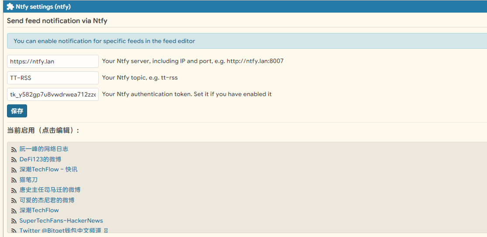
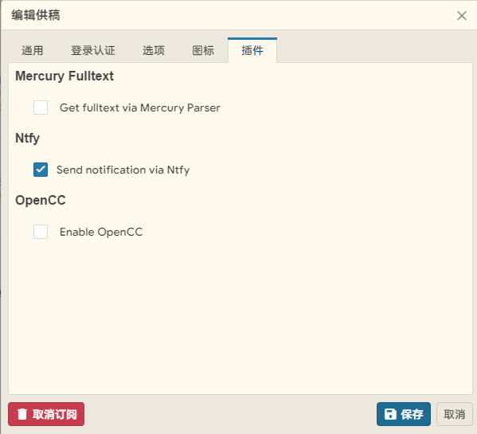
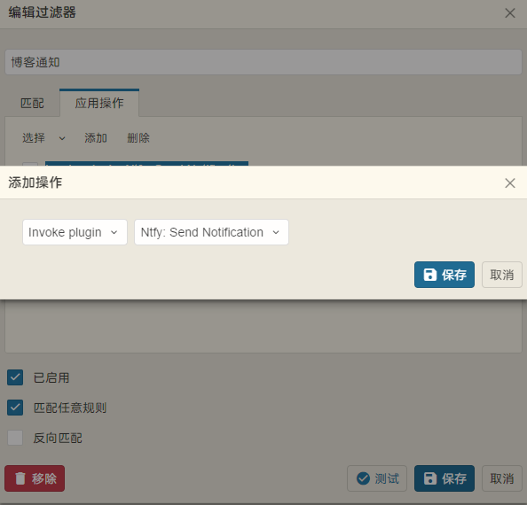

一个用于 Tiny Tiny RSS 的插件，通过 [Ntfy](https://ntfy.sh/)
推送订阅源更新提醒。

## 功能特点

- 支持通过 Ntfy 发送 RSS 订阅更新通知
- 可配合 TT-RSS 过滤推送通知

## 安装步骤

1. 下载本插件到 TT-RSS 的插件目录:

```bash
cd /path/to/tt-rss/plugins
git clone https://github.com/resticDOG/tt-rss-plgin-ntfy.git ntfy
```

1. 在 TT-RSS 管理界面启用插件:
   - 进入偏好设置 -> 插件
   - 找到 "Ntfy"
   - 点击启用

## 配置说明

1. 在插件设置中配置以下参数：
   - Ntfy 服务器地址 (例如: <https://ntfy.sh>)
   - 通知主题 (Topic)
   - Token



## 使用方法

### 1. 订阅源启用

在订阅源编辑页面启用插件，当订阅源更新之后推送



### 1. 结合过滤功能启用

创建一个过滤器，在应用操作中选择 **Invoke plugin**: **Ntfy: Send Notification**



### 故障排除

如果遇到问题，请检查：

1. PHP curl 扩展是否已安装
2. Ntfy 服务器地址是否正确
3. TT-RSS 日志中是否有相关错误信息

### 贡献指南

欢迎提交 Pull Requests 和 Issues！

### 致谢

- [Tiny Tiny RSS](https://tt-rss.org/)
- [Ntfy](https://ntfy.sh/)
- [mercury_fulltext](https://github.com/HenryQW/mercury_fulltext)

### 联系方式

如有问题或建议，请通过以下方式联系：

- 提交 [Issue](https://github.com/resticDOG/tt-rss-plugin-ntfy/issues)
- Pull Requests
